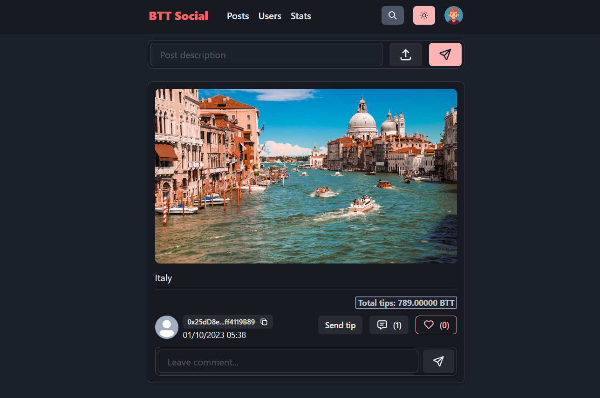
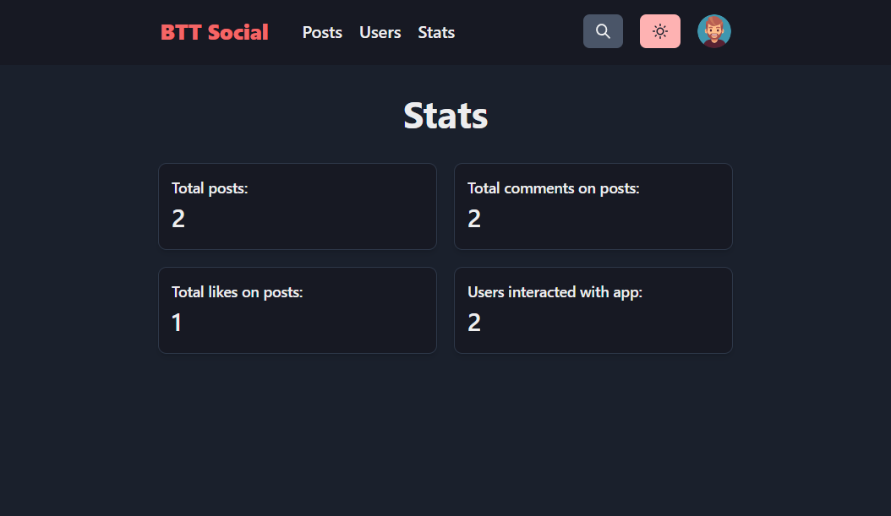
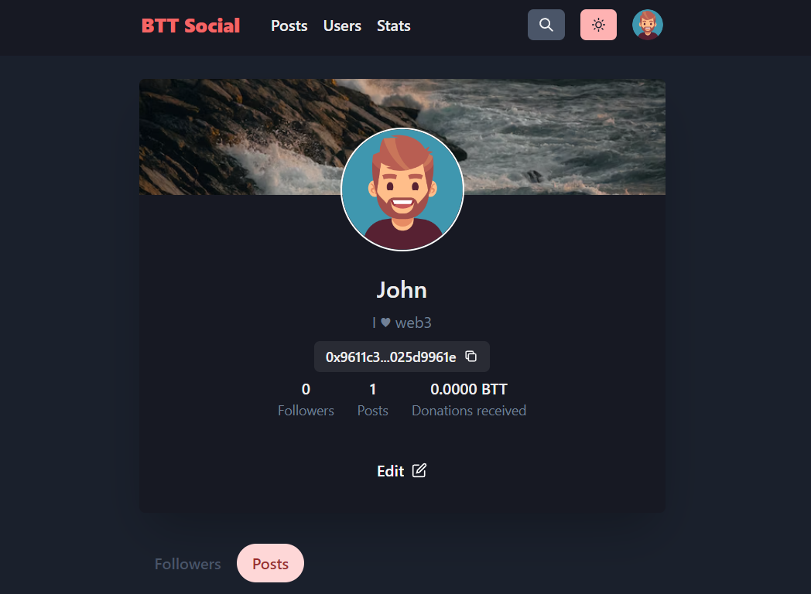

# BTT Social

### Decentralized social media platform on BTT Chain (Testnet)

- Live app:     https://bttsocial.netlify.app
- Video demo:   https://vimeo.com/870002302

-----------

## Smart contract:

- Contract: `0x5897e3e03d78adee601471774f7c96cf58342923`
- Bttscan explorer: https://testnet.bttcscan.com/address/0x5897e3e03d78adee601471774f7c96cf58342923

-----------

## Functionality of the application:
- Connect Metamask wallet;
- View general statistics for BTT Social: number of users, posts, comments & likes;
- Create posts with multimedia content using IPFS;
- Monetize your content (photo, video or audio). Currently only **BTT** asset available for tips;
- Like and leave comments on posts;
- Edit your profile details (name, bio, avatar image);
- Follow and unfollow users;
- Switch from light or dark themes and access the platform in multiple languages;

-----------
  
## Getting Started

To run the frontend app, follow these steps:
1. Clone the repository;
   
2. Create a `.env` file & obtain a secret key from Thirdweb [https://thirdweb.com/dashboard/infrastructure/storage]
   ```
   VITE_THIRDWEB_SECRET_KEY=
   ```
   
4. Install dependencies: ```yarn install```;
   
5. Start the development server: ```yarn dev```;

-----------

## Next steps:

1. Creating an achievement system;
2. Creating a feature to create private content only for those who sent tips;
3. Adding new assets for sending tips;
4. Deploy dapp to BTTC Mainnet.

-----------

# Project screens




